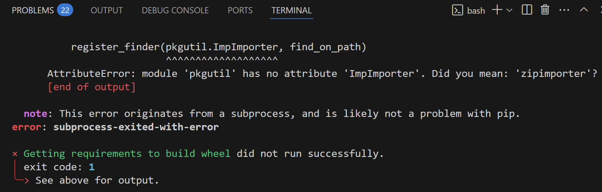
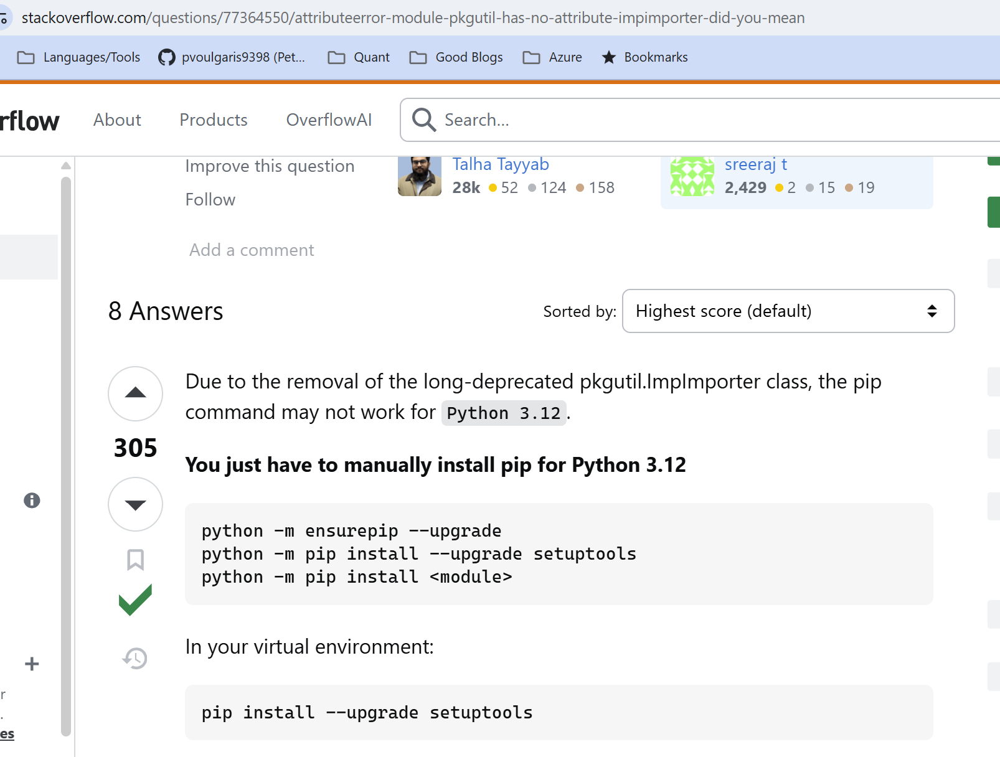

# Notes

## `Thursday, 9/25/25`

- After installing `PyQt6` in my virtual directory (`conda activate quant-dev01`)
- I was still not seeing intellisense work, although I could run the sample program
- Turns out I needed to run `conda activate quant-dev01` and *then* run vscode
- Rather than running vscode, _then_ running `conda activate quant-dev01` from within `vscode`'s integrated terminal

[1](2025-09-25-01.jpg)

- I did *NOT* need the following entry to get this to work:

```json
"python.autoComplete.extraPaths": [
    "${workspaceFolder}",
    "~/miniconda3/envs/quant-dev01/Lib/site-packages/PyQt6"
  ],
```


## `Thursday, 3/20/25`

- [conda](https://docs.conda.io/projects/conda/en/stable/index.html)
- [conda-forge](https://conda-forge.org/)

```bash
conda config --add channels conda-forge
```

- `C:/Users/Peter/.condarc` vs `C:/Users/Peter/miniconda3/.condarc`
- [pip](https://pip.pypa.io/en/stable/getting-started/)
- [dash](https://dash.plotly.com/)
- [dash-bootstrap-components](https://dash-bootstrap-components.opensource.faculty.ai/)
- [PyPortfolioOpt](https://pyportfolioopt.readthedocs.io/en/latest/)
- [openbb](https://openbb.co/)

## `Sunday, 3/16/25`

- Using `conda` environment manager on my new laptop...
- Working through [this](https://github.com/PacktPublishing/Python-for-Algorithmic-Trading-Cookbook)
- Apparently `openbb` is not compatible with python `3.13`, I get get the following, but it works fine with `3.12`



- The following did not work for me:



## `Sunday, 3/9/25`

- Note, did this from scratch on my linux laptop and didn't have any issues, may try to recreate the `.venv` file again on that machine

```text
python3 -m venv ./.venv
```

- Installed `ms-python.black-formatter` and started getting this:

```text
Command line: C:\Program Files\Git\usr\bin\bash.exe '--init-file' 'c:\Users\Peter\AppData\Local\Programs\Microsoft VS Code\resources\app/out/vs/workbench/contrib/terminal/common/scripts/shellIntegration-bash.sh'
```

- It appears to override the `.venv` configuration I already have setup in this folder, figure this out, but not a big deal for now
