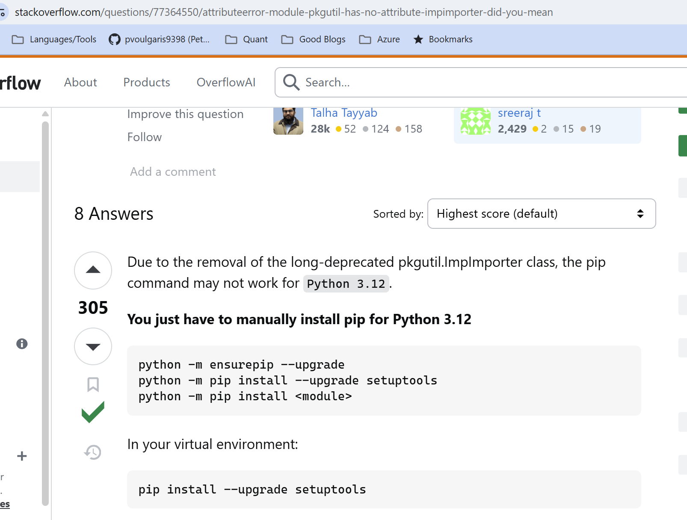

# Notes

## `Sunday, 3/16/25`

- Using `conda` environment manager on my new laptop...
- Working through [this](https://github.com/PacktPublishing/Python-for-Algorithmic-Trading-Cookbook)
- Apparently `openbb` is not compatible with python `3.13`, I get get the following, but it works fine with `3.12`


- The following did not work for me:



## `Sunday, 3/9/25`

- Note, did this from scratch on my linux laptop and didn't have any issues, may try to recreate the `.venv` file again on that machine

```text
python3 -m venv ./.venv
```

- Installed `ms-python.black-formatter` and started getting this:

```text
Command line: C:\Program Files\Git\usr\bin\bash.exe '--init-file' 'c:\Users\Peter\AppData\Local\Programs\Microsoft VS Code\resources\app/out/vs/workbench/contrib/terminal/common/scripts/shellIntegration-bash.sh'
```

- It appears to override the `.venv` configuration I already have setup in this folder, figure this out, but not a big deal for now
